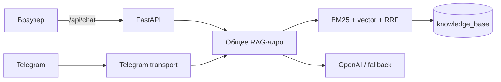

# ВИНОТЕРРА — сайт-путеводитель по вину с ИИ-помощником

[](https://github.com/kirillbadulin74/Vino-terra-site/actions/workflows/tests.yml)

Сайт-путеводитель по миру вина с ИИ-помощником «Нейро-сомелье» прямо на сайте
и в Telegram (@VinoTerra_AI_bot). Это версия для развёртывания на собственном
VPS: статика + Python-бэкенд. Публикация на собственном домене пока не
настроена; статическая версия сайта без чата опубликована отдельно на
[GitHub Pages](https://kirillbadulin74.github.io/Vinoterra-site-html/).

```
frontend/   статика сайта (HTML/CSS/JS + данные data/*.json → wine-data.js)
backend/    Python: RAG-ядро (hybrid BM25+vector), FastAPI веб-API, Telegram-бот
deploy/     nginx-конфиг, systemd-юниты, DEPLOY.md — инструкция развёртывания
```

## Как это работает

- **Сайт** — статические страницы; карточки стран/сортов рендерятся из
  `frontend/data/wine-data.js`. Правки контента: `frontend/CONTRIBUTING.md`.
- **Нейро-сомелье** — единое RAG-ядро (`backend/src/`) на базе знаний
  `backend/knowledge_base/` (5 файлов, 2829 чанков). Два транспорта:
  - `src/web_api.py` — FastAPI: `/api/chat`, `/api/feedback`, `/api/health`
    (чат-виджет на сайте);
  - `src/telegram_bot.py` — Telegram-бот (long polling).
- Поиск hybrid (BM25 + вектор, RRF); при сбое эмбеддингов деградирует до BM25,
  при сбое OpenAI генерация уходит на фоллбэк DeepSeek (если задан ключ).
- Все вопросы и оценки 👍/👎 обоих каналов пишутся в SQLite
  `backend/feedback/feedback.db` (колонка `channel`: web | telegram).

## Архитектура



## Стек

Python 3.12 · FastAPI · OpenAI-compatible API · NumPy · SQLite · vanilla
HTML/CSS/JavaScript · nginx · systemd. Внешний RAG-фреймворк не используется:
чанкинг, BM25, RRF и section expansion реализованы в `backend/src/`.

## Локальный запуск

```bash
# API (из backend/; hybrid требует OPENAI_API_KEY в .env, офлайн-вариант — RAG_MODE=bm25)
cd backend && pip install -r requirements.txt && python run_web_api.py

# сайт (из frontend/)
python -m http.server 8000
# открыть http://127.0.0.1:8000 — чат сам найдёт API на 127.0.0.1:8080
```

## Векторный индекс

Hybrid-поиск использует кеш эмбеддингов `backend/vector_index/` — это производный
артефакт, в Git он не хранится. Соберите его при первом запуске и после правок
базы знаний:

```bash
cd backend && python build_vector_index.py
```

Шаг требует `OPENAI_API_KEY` (эмбеддинги `text-embedding-3-small`) и разово
расходует API. Без кеша и без ключа проект остаётся работоспособным в офлайн-режиме
`RAG_MODE=bm25` — он использует только лексический поиск.

## Пример API

После запуска API локальный вопрос можно проверить без браузера:

```bash
curl -sS -X POST http://127.0.0.1:8080/api/chat \
  -H 'Content-Type: application/json' \
  -d '{"question":"Что такое танины в вине?","history":[]}'
```

Ответ содержит `answer`, список найденных `sources` и `interaction_id` для
последующей оценки ответа.

## Тестирование

Из каталога `backend/`:

```bash
python -m py_compile src/*.py
python -m unittest discover -s tests -v
```

Тесты не обращаются к внешнему API: проверяются доменный гард, follow-up,
региональный retrieval, защита от повторов и форматирование температур.

## Развёртывание на сервере

Полная инструкция — `deploy/DEPLOY.md` (Ubuntu + nginx + systemd + certbot).

## Участие в проекте

Правила изменения карточек, изображений и исходных JSON описаны в
[frontend/CONTRIBUTING.md](frontend/CONTRIBUTING.md). Для изменений backend
добавьте регрессионный тест и проверьте команды из раздела «Тестирование».

## FAQ

**Нужен ли API-ключ для просмотра статических страниц?** Нет. Ключ нужен только
веб-чату и Telegram-транспорту.

**Можно ли запустить поиск без OpenAI?** Да, задайте `RAG_MODE=bm25`; генерация
ответа при этом всё равно требует настроенного LLM-провайдера.

**Где хранятся вопросы и оценки?** В SQLite-файле `backend/feedback/`, который
не включается в Git.

**Почему клон весит больше, чем исходники?** В истории репозитория остались файлы
кеша эмбеддингов, удалённые из текущей версии. Если нужна только рабочая копия, а
не история, клонируйте срезом: `git clone --depth 1 <url>`.

## Команда

Проект поддерживает Кирилл Бадулин (`kirillbadulin74`). Внешние контрибьюторы
могут присылать изменения через pull request.

## Источники и ссылки

- `backend/knowledge_base/*.md` — авторская структурированная база знаний
  проекта о виноделии, регионах и сортах;
- [OpenAI API documentation](https://platform.openai.com/docs) — интерфейс
  генерации и embeddings;
- [GitHub Pages-версия](https://kirillbadulin74.github.io/Vinoterra-site-html/)
  — статический интерфейс без веб-чата.

## Roadmap

- добавить отдельные smoke-проверки `/api/health` и feedback-маршрута;
- расширять покрытие региональных и гастрономических сценариев;
- при необходимости подключить reranking после отдельной оценки качества.

## Лицензия

Проект распространяется по лицензии [MIT](LICENSE).
